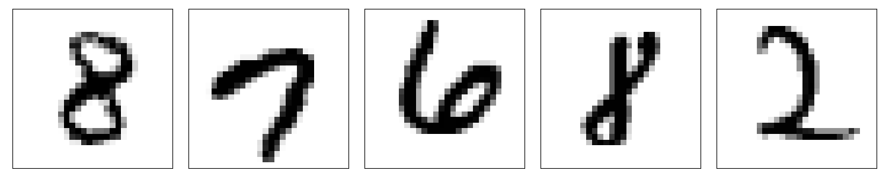

# MNIST Tutorial

The aim of this tutorial is to show large parts of Lightning-Boost's features and how it should be used to solve a typical supervised deep learning problem.
Here, we use a comparatively simple problem: Predict the digit that is depicted on a small greyscale image as integer number. It is also known as *MNIST classification problem*, named by the corresponding MNIST dataset.



The development of a codebase that solves such a problem using Lightning-Boost consists of seven components that have to be implemented: 

- Dataset
- Preprocessing
- Datamodule
- Model
- System
- Loss functions and metrics
- Main script

The scope of the implementation is reduced to the very problem-specific bits, whereas common boilerplate code is hidden in several base classes and utility functions.
In the following, we go step by step through the implementation of these modules to solve the MNIST classification problem.


## Directory Structure

  Before we can start the actual implementation, we need to define a directory structure.
  For this tutorial, we mainly stick to the [recommended directory structure of Lightning-Boost](../how-to-guides.md#directory-structure) and only omit the `./modules/trainable/` subfolder, as we have only one model that is not complex enough to justify the outsourcing of trainable modules.
  Therefore, our directory structure is as follows:

  ```
  .
  ├── data/
  │   ├── datamodules/
  │   └── datasets/
  ├── models/
  ├── modules/
  │   ├── loss/
  │   ├── metrics/
  │   └── preprocessing/
  └── systems/
  ```


## Dataset

  We start by defining a specialized *dataset* class `MNISTDataset` that is derived from the base class `lightning_boost.data.datasets.BaseDataset`, which is itself an extended version of PyTorch's `torch.utils.data.Dataset` class.
  `BaseDataset` extends the basic `Dataset` class of PyTorch by the automatic application of transforms to input and target data as well as the automatic data download, if not located on disk yet.

  As for the basic `Dataset` class of PyTorch, we necessarily have to override two methods that return the length of the dataset and the data at a specific index, respectively. 
  For `BaseDataset`, these are `__len__()` and `get_item()` (not `__getitem__()`!). 
  Optionally, we can override the method `download()`, if we want to implement the automatic data download.
  Last, when overriding `__init__()` to load the data, one has to call the `__init__()` method of the `BaseDataset` super class inside, prior to the data loading logic.

  The `__init__()` method of the `BaseDataset` class expects the three parameters `root, download, transform`, which correspond to the path where the data is (to be) stored on disk, whether it should be downloaded, and the transform(s) applied to input and target data, respectively.
  After initialization, `BaseDataset` provides the attribute `path` (an instance of `pathlib.Path`), which is simply the passed `root` path with an additional directory named by the class name of the custom dataset class (in this case, `mnist_dataset`). 
  It should be used when implementing the `download()` method or the data loading logic in the `__init__()` method.

### Initialization

  For our MNIST example, we take advantage of the fact that the MNIST dataset is already contained as class `MNIST` in the `torchvision` package, and use our specialized `MNISTDataset` class as a wrapper class.
  Therefore, we override `__init__()` and pass an additional parameters `train`, which indicates whether we want to access the training oder test dataset of MNIST. 

  ``` py title="./data/datasets/mnist_dataset.py"
  --8<-- "data/datasets/mnist_dataset.py:init"
  ```

  1. Simply pass the parameters `root, download, transform` of `BaseDataset` to this super class's `__init__` call.
  2. Since the automatic data download of `BaseDataset` takes care of data downloads, we set the `download` parameter to `False` here.

### Download

  The MNIST dataset of torchvision also provides automatic data download, so we implement the `download()` method of our `MNISTDataset` class by initializing torchvision's MNIST dataset and triggering the download explicitly for both the training and the test dataset.

  ``` py title="./data/datasets/mnist_dataset.py"
  --8<-- "data/datasets/mnist_dataset.py:download"
  ```

### Get-item

The `get_item()` method takes an integer index and returns the corresponding input and target data of the dataset. 
Internally, it is called by the `__getitem__()` method of the `BaseDataset` class, which then also applies the transforms to input and target data.

Since the `__getitem__()` method of torchvision's MNIST class is implemented properly, we can simply access the image as well as the label by indexing the dataset. 
Next, as this is how we pass input and target data in the Lightning-Boost framework, we return two dictionaries, containing the input and target data, respectively. 

Keys can be set customly; for convenience, however, `"x"` and `"y"` are recommended for such a single-task problem. 

  ``` py title="./data/datasets/mnist_dataset.py"
  --8<-- "data/datasets/mnist_dataset.py:get_item"
  ```

### Len

Finally, in the `__len__()` method, we simply return the length of torchvision's MNIST dataset.

  ``` py title="./data/datasets/mnist_dataset.py"
  --8<-- "data/datasets/mnist_dataset.py:len"
  ```

### Init file

To allow simpler import statements, we create a file `__init__.py` where we import the class `MNISTDataset` that was just implemented.
This is also done for the following specializations of base classes, but we refrain from mentioning there explicitly for the sake of brevity.

  ``` py title="./data/datasets/__init__.py"
  --8<-- "data/datasets/__init__.py"
  ```


## Preprocessing

The functionality implemented in the *preprocessing* refers to manipulation of the data's content and structure, before it is fed into the model(s).
Lightning-Boost (and PyTorch) distinguish here between *transforms* and the *collator*, whereas the latter is a special transform to enable data batching.
As already mentioned in [Dataset/Get-Item](#get-item), input and target data are passed between different components via two separate dictionaries.

### Transforms

For the general transforms, Lightning-Boost provides the base class `BaseTransform` as well as the class `CompositeTransform`, which inherits from `BaseTransform` and allows the composition of several `BaseTransforms`. 
Specialization of `BaseTransform` requires only the implementation of the `__call__()` method, which takes the dictionaries for input and target data and returns two dictionaries containing the transformed input and target data.

In this tutorial on the MNIST classification problem, we want to implement a transform that standardizes the input data (i.e., setting their mean and variance to 0 and 1, respectively).
Since torchvision's MNIST dataset returns the input image as `PIL.Image` and the label as python integer, we also have to implement a transform that converts both to `torch.Tensor`.

The latter is achieved by implementing the class `ToTensorTransform`, which simply calls `to_tensor()` (provided by torchvision) on the input image and creates a tensor out of the label. Note that in PyTorch, labels should be stored in 64-bit integer tensors.

  ``` py title="./modules/preprocessing/mnist_transform.py"
  --8<-- "modules/preprocessing/mnist_transform.py:to_tensor_transform"
  ```

For the standardization, we implement another subclass of `BaseTransform`, named `StandardizeTransform`. 
Mean and standard deviation are passed on initialization. Standardization is then applied to the input data in the `__call__()` method using torchvision's function `normalize()`.

  ``` py title="./modules/preprocessing/mnist_transform.py"
  --8<-- "modules/preprocessing/mnist_transform.py:standardize_transform"
  ```

  1. Note how the name of `torchvision.transforms.functional.normalize` is actually wrong, since we perform a *standardization* (setting data's mean and variance to 0 and 1, respectively) and not a *normalization* (rescaling data to a specific range, typically [0, 1]).

Last, because `BaseDataset` expects a single instance of `BaseTransform`, we implement a third transform class `MNISTTransform`. It contains the composition of `ToTensorTransform` and `StandardizeTransform` by incorporating the corresponding `CompositeTransform` as attribute.
Since the mean and standard deviation of the MNIST dataset are known, they are passed as constants to the `StandardizeTransform`.

  ``` py title="./modules/preprocessing/mnist_transform.py"
  --8<-- "modules/preprocessing/mnist_transform.py:mnist_transform"
  ```

### Collator

For the collator, Lightning-Boost provides the base class `BaseCollator`. 
When implementing a specialized subclass of it, we only need to override the method `get_collate_fn()`, which returns a dictionary of (string, function) pairs:
For each key in the two input and target data dictionaries returned by the used transform, we need to specify a collator function.
Such a collator function takes a list of tensors and returns a single tensor that stacks the passed tensors along a new batch dimension.

`BaseCollator` already contains the two collator functions `pad_collate_nd` and `flatten_collate`.
The first one should be used for potentially differently shaped multi-dimensional tensors, where different shapes are unified by padding.
The function `flatten_collate`, by contrast, takes one-dimensional tensors and concatenates them.

As our `MNISTTransform` returns dictionaries with the keys `"x"` for three-dimensional image tensors and `"y"` for single-element label tensors, we have to specify the collator function for exactly these two types of data.
With the mentioned properties, we use `pad_collate_nd` for `"x"` and `flatten_collate` for `"y"`.

  ``` py title="./modules/preprocessing/mnist_collator.py"
  --8<-- "modules/preprocessing/mnist_collator.py:mnist_collator"
  ```


## Datamodule

The *datamodule* manages the distribution of data to the system during training, validation and testing.
To implement it for our MNIST example, we need to extend the base class `BaseDatamodule`.
Here, we need to implement the four methods `get_transform()`, `get_collator()`, `get_dataset_type()`, and `get_train_val_test_split()`.
Thanks to the preliminary work already done, this is less than it sounds.

For the first two methods, we can simply return instances of the `MNISTTransform` and `MNISTCollator`, respectively.
The `get_dataset_type()` method then returns the type of our custom dataset, i.e., `MNISTDataset`.

Finally, `get_train_val_test_split()` is meant to create splits of the total dataset for training, validation and testing.
Since the MNIST dataset is pre-split into a training and a test dataset, we directly use the latter as such.
For the training-validation split, on the other hand, we create a random split of the traning data utilizing the function `torch.utils.data.random_split`.
Here, we use the attribute `val_ratio` of `BaseDatamodule`, which is passed on initialization.
Analogously, there is an attribute `test_ratio`, which we do not need for this MNIST example.

Note that `BaseDatamodule` provides the method `instantiate_dataset()`, where we do not need to pass the three parameters `root`, `download`, `transform` of a `BaseDataset`, but only additional parameters of our custom dataset class (in this case, `train`). 

  ``` py title="./data/datamodules/mnist_datamodule.py"
  --8<-- "data/datamodules/mnist_datamodule.py:mnist_datamodule"
  ```


## Model

The *model* is the actual predictive, trainable component in the system.
In Lightning-Boost, we implement a model by extending the base class `BaseModel`, which is a `LightningModule` equipped with an additional name attribute.
By default, it is set to the dasherized, lowercase version of the class name.
As for the regular `LightningModule`, we only need to define the architecture of our model in the `__init__()` method (without forgetting to call the `__init__()` of the super class) as well as its forward pass in the `forward()` method.

For this example, we use a basic fully-connected network architecture with two 256-wide hidden layers and ReLU activation.

  ``` py title="./models/mnist_model.py"
  --8<-- "models/mnist_model.py:mnist_model"
  ```


## System

Yet the *system* manages the whole training, validation and testing process, its implementation is rather simple.
Again, we extend a base class provided by Lightning-Boost, in this case `BaseSystem`.
To do so, only one method `step()` has to be implemented.

Before that, however, some clarification is needed on the initialization of a system.
The class `BaseSystem` takes three mandatory parameters -- `models`, `loss` as well as `optimizer` -- and several optional ones.
For now, however, only `models` is relevant.
It is either a list of `BaseModel` instances or a single `BaseModel` instance, which are/is then stored in the dictionary attribute `models`, with the name attribute of the `BaseModel` instance(s) as key(s).
In our case, as we have only one model class `MNISTModel` where we use the default name, the corresponding model instance is stored under the key `"mnist-model"`.

The `step()` method performs one iteration of training/validation/testing by taking the two dictionaries for (transformed and batched) input and target data and returning a dictionary of predictions.
Here, the keys of the returned predictions dictionary must match the keys of the target data dictionary.
In our MNIST example, we only have one type of target data with key `"y"`, so we return one prediction tensor with the same key.
To compute the predictions, we simply take the input data and feed it into the `MNISTModel`.

  ``` py title="./systems/mnist_system.py"
  --8<-- "systems/mnist_system.py:mnist_system"
  ```


## Loss Functions and Metrics

To support the features of Lightning-Boost, both loss functions and metrics need to be defined through the usage of special wrapper classes, namely `TaskLoss` and `TaskMetric`.
However, this becomes only relevant when making configurations and executing the main script (see [Execution](#execution)).
For the implementation, we can use any proper class that inherits from `torch.nn.Module` and `torchmetrics.Metric` as loss function and metric, respectively.

In this tutorial, we do not implement custom loss functions or metrics, but use PyTorch's `CrossEntropyLoss` and torchmetrics' `MulticlassAccuracy`.
We simply import them in two `__init__.py` files.

  ``` py title="./modules/loss/__init__.py"
  --8<-- "modules/loss/__init__.py"
  ```

  ``` py title="./modules/metrics/__init__.py"
  --8<-- "modules/metrics/__init__.py"
  ```


## Main Script

As promised, the main script consists of only one actual line of code (excluding imports).
These imports, however, are essential, as they allow accessing the implemented classes from the command line interface (CLI).

Hence, we import `models`, `systems`, `data.datamodules`, `data.datasets`, `modules.loss`, and `modules.metrics`.
We also need the class `LightningBoostCLI`, which defines the CLI.

Subsequently, in the main function, we simply instantiate the CLI.
And that's it.

  ``` py title="./main.py"
  --8<-- "main.py"
  ```


## Execution

### Command line interface

The execution of the main script is strictly defined through the subcommands `fit`, `validate`, `test`, which either run the full optimization routine, or one epoch on the validation or test split, respectively.
Futhermore, we must specify the arguments `--system` and `--data` by passing the names of our implemented system `MNISTSystem` and datamodule `MNISTDatamodule`.
As the latter has no non-default parameters, we are fine here.

For the `MNISTSystem`, by contrast, we need to set parameters `models`, `loss` and `optimizer`.
For the model, we again just pass the name of the corresponding class `MNISTModel`.

The parameter `loss`, however, needs to be of type `TaskLoss`, so we pass `TaskLoss`, for which we have to specify the parameter `instance`.
Here, we simply pass `CrossEntropyLoss`.

Last, for the optimizer, we just pass `Adam` and use its default parameters.

The optional parameters of `MNISTSystem` are `lr_scheduler`, `lr_scheduling_policy`, `train_metrics`, `val_metrics`, and `test_metrics`.
As a learning rate scheduler, we use (and pass) `ReduceLROnPlateau` with default parameters.
The parameter `lr_scheduling_policy` takes an instance of the class `LRSchedulingPolicy` provided by Lightning-Boost, specifying, e.g., how often learning rates are adapted. 
As it is used as default, we do not explicitly have to pass anything, unless we want to change the policy's default parameters.

For all three remaining parameters related to the metrics, we have to specify a `TaskMetric`, similar to the loss.
Then, for its parameter `instance`, we set `MulticlassAccuracy` with `num_classes=10`, as there are ten classes in the MNIST classification problem.

In the end, the final command for model fitting looks as follows:

```
$ python main.py fit \
    --data=MNISTDatamodule \
    --system=MNISTSystem \
        --system.models=MNISTModel \
        --system.loss=TaskLoss \
            --system.loss.instance=CrossEntropyLoss \
        --system.optimizer=Adam \
        --system.lr_scheduler=ReduceLROnPlateau \
        --system.train_metrics=TaskMetric \
            --system.train_metrics.instance=MulticlassAccuracy \
                --system.train_metrics.instance.num_classes=10 \
        --system.val_metrics=TaskMetric \
            --system.val_metrics.instance=MulticlassAccuracy \
                --system.val_metrics.instance.num_classes=10 \
        --system.test_metrics=TaskMetric \
            --system.test_metrics.instance=MulticlassAccuracy \
                --system.test_metrics.instance.num_classes=10
```

### YAML configuration

Since this is quite lengthy and we definetely do not want to retype everything if we run the script more than once, we can luckily generate a configuration file.
To do so, we add `--print_config > config.yaml` to the command above, and it creates the configuration file `config.yaml`.
At first, this looks even more lengthy, but one can optionally remove every default parameter setting to make it clearer.
Finally, we can run the config-based fitting process via the command `python main.py fit --config config.yaml`.

When the training has been finished, we can test our model using the subcommand `test` and the argument `--ckpt_path`, where we pass the path to the checkpoint of our trained model.
By default, run logs are stored in the directory `lightning_logs`, named by date and timestamp. 
For the remaining configuration, we can reuse `config.yaml`.